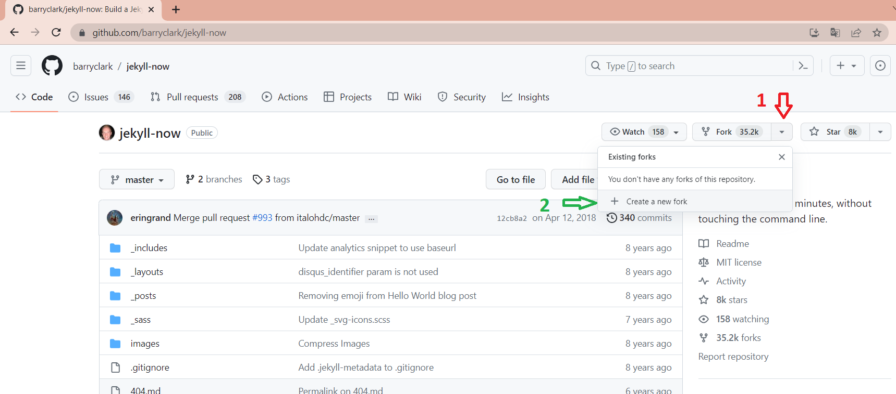
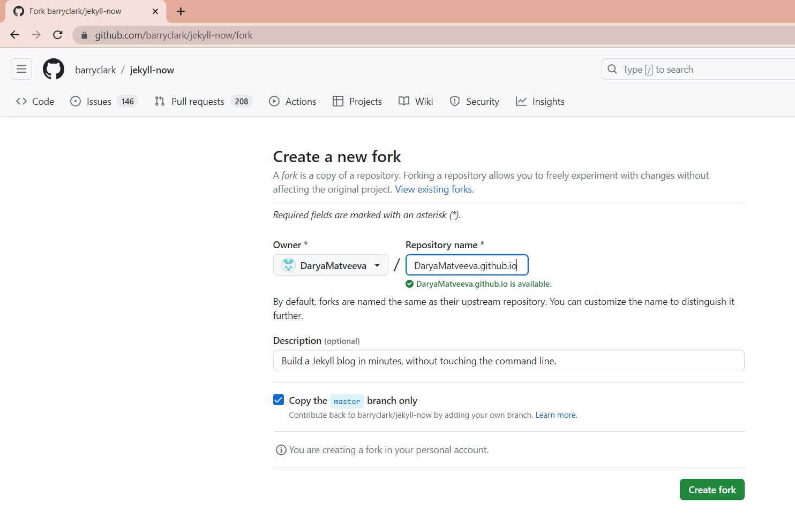
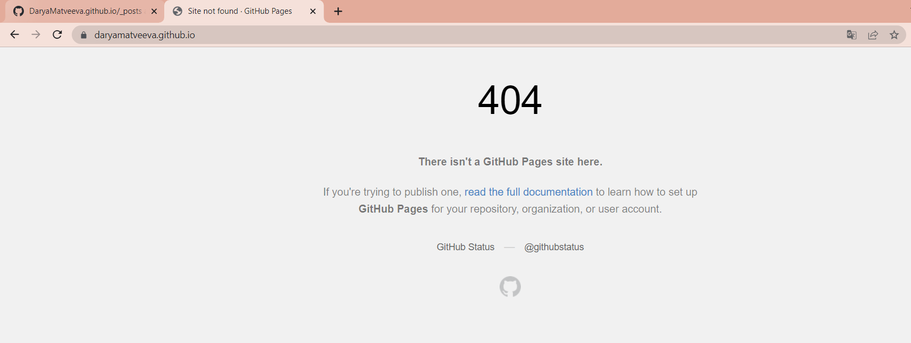
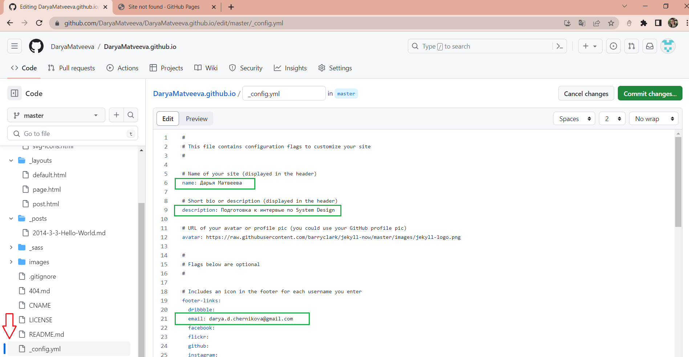
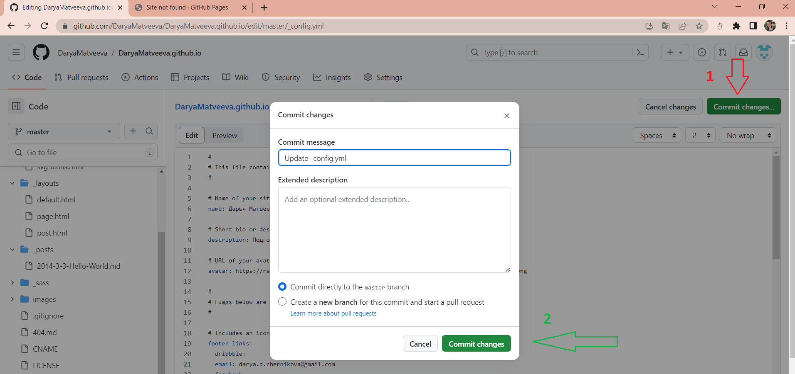
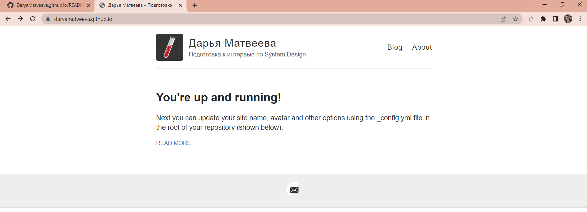
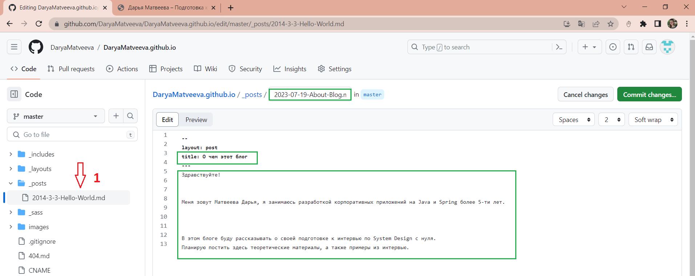
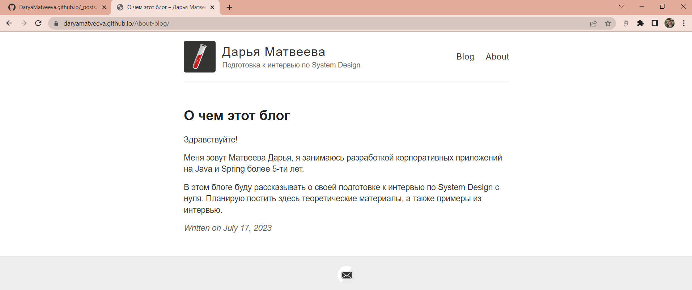
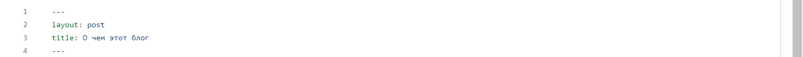

Здравствуйте!
В этом посте расскажу, как создавала этот блог.

GitHub Pages - это бесплатный хостинг от GitHub для хранения статических сайтов.
Чтобы использовать его, необходимо иметь аккаунт на GitHub.
Я использовала Jekyll - генератор статических сайтов. Он сам собирает html-страничку, нужно лишь создать markdown 
файл с текстом поста, а также обновить метаданные, такие как ваше имя, название блога и описание.

Сначала расскажу, как запустить блог и написать первую статью, используя только возможности GitHub в браузере.

Потом можно будет скачать и собирать проект локально, чтобы отлаживать блог и не делать лишние коммиты из-за, 
например, орфографических ошибок. Каждый раз, когда вы вносите изменения в свой репозиторий, происходит сборка, а для 
сайтов GitHub Pages установлено ограничение в 10 сборок в час. 

#### Шаг 1.

Войдите в свой аккаунт на Github и откройте репозиторий https://github.com/barryclark/jekyll-now.
Форкните репозиторий, и переименуйте, используя имя в формате вашлогинgithub.github.io.

###### 1. 

###### 2. 

Перейдем на сайт https://daryamatveeva.github.io/, и увидим, что пока он не запущен.

###### 3. 

#### Шаг 2.

Попробуем инициировать сборку, внеся изменения в _config.yml.
Обновляем название блога, описание, и адрес электронной почты для связи.

###### 4. 

Комитим изменения.

###### 5. 

Сайт собрался сразу и теперь доступен! Но вообще, сборка может занимать до 10 минут.

###### 6. 

#### Шаг 3.
Создадим первый пост.
Для этого редактируем файл /_posts/2014-3-3-Hello-World.md . Я использовала
[подсказку по стилям в Markdown](http://www.jekyllnow.com/Markdown-Style-Guide/).

###### 7. 

Смотрим изменения на сайте.

###### 8. 

#### Шаг 4. 

Создаем новые посты в репозитории. Для этого нажимаем иконку + в папке /_posts/ .

###### 9. 

Имя файла должно быть в формате _год-месяц-день-название-поста.md_ .
А также необходимо добавлять блок front-matter в начало поста.

###### 10. 

#### Шаг 5.

**Ура, блог запущен!**

_Источники:_
* _https://github.com/barryclark/jekyll-now_
* _https://docs.github.com/ru/pages/getting-started-with-github-pages/about-github-pages_
