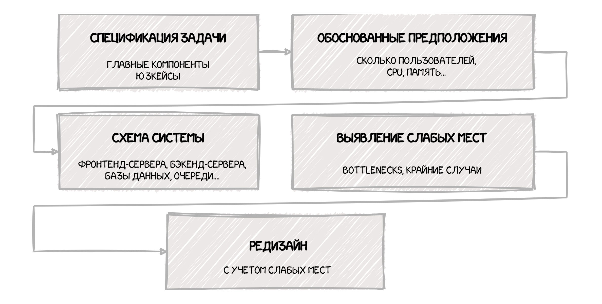

Здравствуйте!
В этом посте - обзор  решения задач по System Design, приведенного в главе "System design 
and scalability" из книги **"Cracking the coding interview"**.

Алгоритм может быть полезен тем, кто только начинает разбираться в теме.

Автор считает, что вопросы по SD предназначены для того, чтобы выяснить, как бы вы спроектировали реальную систему 
на работе, 
если бы ваш менеджер об этом попросил. Поэтому действуйте так, как действовали бы на работе. Задавайте вопросы. 
Находите компромиссы. И помните, что есть хорошие решения и плохие решения, но нет идеальных.

### Как вести себя на интервью?

- **Разговаривайте с интервьюером**. Главная цель интервью - оценить вашу способность к обсуждению. Поэтому не 
  замыкайтесь, задавайте вопросы.

- **Набросайте систему широкими мазками**. Не стоит сразу вдаваться в подробности и фокусироваться на отдельных частях.

- **Рисуйте на доске или в редакторе.** С самого начала рассуждений.

- **Принимайте во внимание замечания интервьюера**. 

- **Будьте аккуратны с допущениями**. Неправильное допущение может полностью изменить задачу.

- **Сделанные допущения обязательно озвучивайте**.

- **Когда необходимо, делайте оценки.** Например, о нагрузке на систему, о количестве требуемой памяти.

### Дизайн пошагово.

#### Шаг 1. **Специфицируйте задачу**. 
Допустим, вас просят cпроектировать TinyURL, сервис для сокращения URL-адресов. Проясните детали. Например, сокращенный 
URl будет генерироваться автоматически, или пользователь сможет сам его указать? Короткий URL будет доступен 
вечно или только ограниченное время?

Определите список главных компонент системы и юзкейсов. Например, для TinyURL:
- Превращение URL в короткий URL.
- Аналитика URL.
- Получение длинного URL из короткого.
- Аккаунты пользователей.

#### Шаг 2. **Сделайте обоснованные предположения**.
Можно делать предположения касательно системы, но они должны быть обоснованными. Например, вряд ли есть основания 
полагать, что система должна обрабатывать всего 100 ссылок в день, или что имеется бесконечно большая база данных для их
хранения. Но можно допустить, что  в день будет обрабатываться максимум миллион ссылок. Исходя из этого можно посчитать нужное количество памяти для хранения ссылок.

#### Шаг 3. **Нарисуйте Главные Компоненты**.

Нарисуйте схему вашей системы. Фронтенд-сервера, бэкенд-сервера, базы данных. Попробуйте вообразить процесс от 
начала до конца. Что происходит, когда пользователь вводит URL?

#### Шаг 4. **Попробуйте найти слабые места системы**.

В случае TinyURL, может сложиться ситуация, когда какая-то ссылка резко станет популярна. Например, кто-то 
запостит ее на популярном ресурсе типа Пикабу. Будет ли разумно доставать ссылку из базы данных при каждом 
обращении?

#### Шаг 5. **Проведите редизайн с учетом слабых мест.**

Возможно, вам понадобится переделать систему полностью. А может быть просто сделать небольшие доработки. Добавить 
кэш например.

Не пытайтесь скрыть слабые места в своем дизайне. Лучше обсудите их с интервьюером, потому что он скорее всего и так 
в курсе о них.

Ваша цель - это не спроектировать заново систему, на которую компания потратила миллионы долларов, а продемонстрировать,
что вы можете анализировать и решать задачи. Находить слабые места в своем собственном решении - отличный способ это
продемонстрировать.

