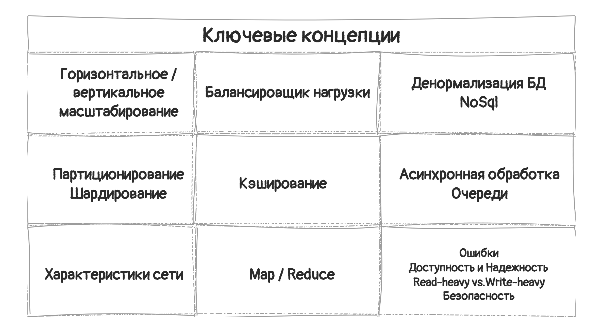

В этом посте продолжим обзор главы "System Design and Scalability" из книги "Cracking the coding interview". На 
этот раз обсудим базовые концепции, с которыми автор рекомендует ознакомиться перед интервью.

#### 1. Горизонтальное / вертикальное масштабирование.

Если система не справляется с нагрузками, ее можно масштабировать двумя путями.

**Вертикальное масштабирование** - увеличиваем ресурсы отдельно взятого сервера. Например, добавляем оперативную память, 
дисковое пространство и т.д. 

**Горизонтальное масштабирование** - увеличиваем количество серверов в системе, чтобы снизить нагрузку на отдельно 
взятый сервер. 

Вертикальное масштабирование легче, но имеет предел. Невозможно добавлять ресурсы до бесконечности.

#### 2. Балансировщик нагрузки.

Для масштабируемого веб-сайта фронтенд и бэкенд сервера могут быть разделены балансировшиком нагрузки. Он 
перераспределяет трафик между бэкенд серверами, и если сервер падает, это не влечет за собой падение 
целой системы. На бэкенде при этом будет сеть из клонированных серверов с одинаковым кодом и доступом к 
одним и тем же данным.

#### 3. Денормализация БД и NoSQL.

Джойны в реляционной БД могут становиться очень медленными когда система растет. Денормализция - один из способов 
избежать этого. Ее суть в том, что для ускорения чтения в таблицу добавляется избыточная информация. 
Например, у вас есть таблица заданий и проектов, и вам надо доставать названия проектов и информацию о задании. 
Можно в рамках денормализации добавить название проекта в таблицу с заданиями.

Также можно перейти на NoSQL базу. Там невозможны джойны, и они спроектированы, чтобы лучше масштабироваться.

#### 4. Партиционирование БД и шардинг. 

**Шардинг** - это техника масштабирования, когда данные разносятся по нескольким машинам. При этом должен быть способ, как 
определить, где находится запрашиваемые данные.

**Партиционирование** - более общий термин, данные при этом могут находиться на одной машине.

Есть несколько способов партиционирования.

* **Вертикальное** - по признаку. Например, вы проектируете социальную сеть. Вы можете сделать партицию для таблиц, 
  которые относятся к страницам пользователей, другую для сообщений, и так далее. 
  + _Минус_. Если таблицы  становятся слишком большими, может быть придется переделать партиционирование (возможно 
    используя другую схему).

* **Key-Based** (Hash-Based) - используется какая-то часть данных (например ID)  дял партиционирования. Очень 
   простой способ разделить данные между N серверами - брать номер сервера, равный остатку от деления ключа на N. 
  + _Плюсы_: простота. 
  + _Минусы_: сложно добавлять сервера. Для этого нужно делать дорогую реаллокацию.

* **Directory-based** - при этом подходе создается и поддерживается таблица, где хранятся адреса данных. 
  + _Плюсы_: относительно просто добавлять новые сервера. 
  + _Минусы_: 
    1. Таблица - единая точка отказа. 
    2. Постоянные обращения к этой таблице ухудшают 
    производительность.

#### 5. Кэширование.

Кэш - это просто словарь ключ-значение. Обычно располагается между слоем приложения и слоем данных.
Когда приложение запрашивает информацию, сначала проверяется кэш. Если в кэше информации нет, проверяется БД. 
Также можно закэшировать запрос и его результат, объект (например, список самых свежих постов вебсайта и т.д.).

#### 6. Асинхронная обработка и очереди.

В идеале, медленные операции должны выполняться асинхронно. Иначе пользователь может испытать сильное неудобство, 
ожидая завершения, например, процесса обновления.

А для большого количества однотипных операций можно использовать очередь. Например, вы создаете софт для телеком 
оператора, и ваша программа должна активировать сотни телефонных номеров для крупных организаций. Вы можете 
поставить процессы активации в очередь, и выполнять их ночью, когда нет процессов активации номеров для физических лиц.

#### 7. Характеристики сети.

* **Ширина полосы пропускания** (Bandwidth) - максимальное количество данных, которые могут быть переданы в единицу 
  времени (обычно биты или их производные в секунду).

* **Пропускная способность** (Throughput) - это количество данных, которое на данный момент передается в единицу 
  времени.

* **Задержка** (Latency) - время, за которое данные проходят путь с одного конца на другой. Время от момента, когда 
  отправитель отправил данные и до момента, когда получатель их получил.
Задержки часто недооцениваются, но они могут быть очень важны в некоторых типах программ, например в онлайн играх. 

#### 8. Map/Reduce

Программа  Map/Reduce используется, чтобы обрабатывать большие массивы данных. Нужно написать 2 шага - Map и Reduce.

**Map** принимает данные и возвращает пару `<Ключ, Значение>`

**Reduce** берет ключ и множество ассоциированных значений, и "редуцирует" их, возвращая новые `<Ключ, Значение>`. 
Которые могут быть снова переданы на шаг Reduce. Это позволяет делать обработку параллельно.

#### 9. Дополнительно
Примите во внимание следующие моменты:

* **Ошибки** (Failures) - тут все понятно. Надо настроить обработку ошибкок.

* **Доступность** (Availability) - процент времени, когда система работает.
**Надежность** (Reliability) - вероятность, что система работает в конкретный момент времени.

* **Read-heavy vs. Write-heavy**. Если в приложении совершается много чтений или записей, это напрямую 
  влияет на дизайн. Если много записей, можно попробовать добавить запросы на запись в очередь. Если много чтений - 
  добавить кэш.

* **Security** - надо предусмотреть, какие проблемы с безопасностью могут возникнуть в системе.
