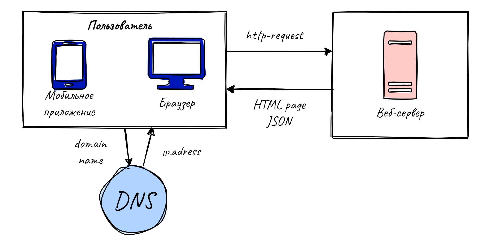
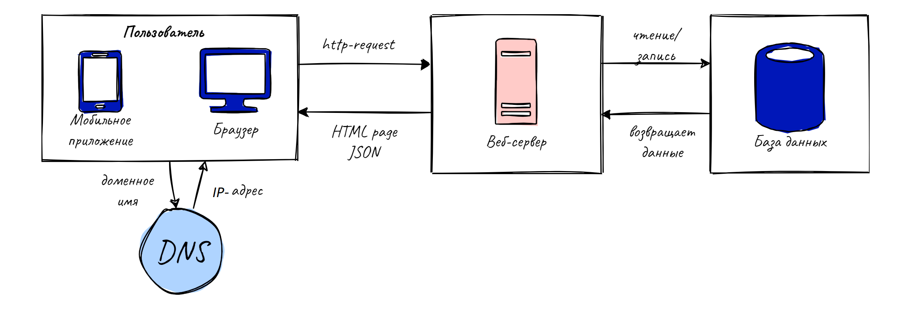
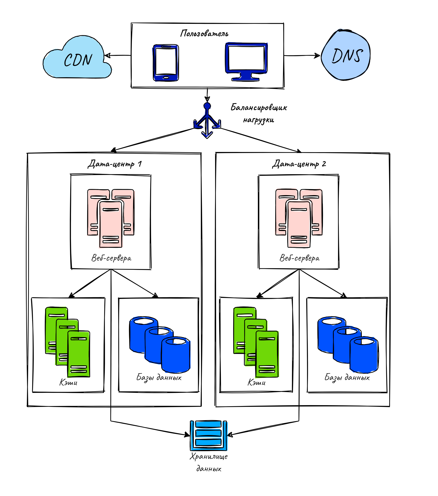

В этом посте рассмотрим некоторые приемы масштабирования системы, которая растет с одного пользователя до миллиона. 
Пост основан на главе 1 книги Алекс Сюй: System Design.

### Один сервер 

Начнем со случая, когда наш сайт совсем маленький и непопулярный. В системе есть только 1 сервер, на котором 
крутится все - сам вебсайт, база данных, кэш и т.д. Давайте посмотрим, какой путь проходит пользовательский запрос.

1. Пользователь через браузер или мобильное приложение запрашивает вебсайт по доменному имени, например  api.mysite.
   com. DNS - Domain Name System («система доменных имён») - это платный сторонний
   сервис, который возвращает IP адрес по доменному имени.
2. IP-адрес возвращается в браузер или мобильное приложение. Например 01.125.01.214.
3. Когда получен IP адрес, HTTP-запрос отсылается на ваш сервер.
4. Веб сервер возвращает HTML-страницу or JSON.

### База данных

Когда количество пользователей растет, один сервер не справляется с нагрузкой. Мы можем разнести веб-сайт и базу 
данных на разные сервера, чтобы масштабировать их независимо.
Теперь, как упоминалось в предыдущей статье, систему можно масштабировать вертикально, добавляя мощности отдельному
серверу, или горизонтально, добавляя новые сервера.

### Балансировщик нагрузки

Балансировщик нагрузки распределяет траффик между серверами. Если один из серверов упадет, то нагрузка будет перенаправлена на другой.
Также, система становится более безопасной, т.к. приватные адреса серверов недоступны в интернете, всю 
коммуникацию между ними берет на себя балансировщик нагрузки. 

### Репликация базы данных

Теперь можно попробовать масштабировать слой базы данных, используя репликацию.

Суть ее в том, что выделяют 2 типа серверов. Master-сервер поддерживает только операции на запись. Slave-сервера 
делают копии с мастера и поддерживают только операции на чтение.
Для большинства приложений характерно преобладание модификаций данных над чтениями, поэтому Slave-серверов обычно больше, чем мастеров.
В общих чертах, если один из Slave-серверов упадет, чтения будут временно перенаправлены на другие Slave-сервера. А 
если упадет Мaster-сервер, то его временно заменит один из Slave-серверов. В реальности все не так просто, потому что данные на 
Slave-сервере могут быть не всегда актуальными. В таком случае на Slave-сервере сначала прогоняются скрипты для 
актуализации данных, а затем он становится мастером.

### Кэш и CDN

Теперь попробуем уменьшить время отклика нашего сайта.
Способы этого достигнуть:
* Добавить кэш на отдельном сервере, куда в первую очередь будет обращаться веб-сервер.
* Перенести статический контент (JavaScript/CSS/image/video files) в CDN (content delivery network, сеть доставки и 
  дистрибуции содержимого). Когда пользователь посещает веб-сайт, сервер CDN, который расположен к пользователю ближе всего, отправляет ему 
статический контент, например, картинку.

### Stateless vs Stateful архитектура

Один из способов масшабировать веб-слой, это убрать из него данные о пользовательских сессиях и хранить их в базе 
данных, откуда эти данные может получать каждый веб-сервер. Это 
называется stateless-веб-слой.

В случае stateful архитектуры, сервер хранит данные сессии клиента между запросами. 
Каждый запрос пользователя должен быть перенаправлен именно на тот сервер, на котором он залогинился. Это 
легко может быть сделано с помощью балансировщика нагрузки (sticky sessions) но это порождает некоторые проблемы. 
Например, намного сложнее добавлять и убирать сервера, а также организовать обработку ошибок.

В случае stateless архитектуры, HTTP-запрос пользователя может быть направлен на любой сервер. Сервер запросит 
данные сессии из общего хранилища данных.

### Дата центры

Когда веб-сайт становится популярным и привлекает множество пользователей по всему миру, чтобы улучшить доступность для 
разных географических зон, необходимо иметь дата-центры в разных частях света.
В этом случае, используя гео-локацию юзера, можно направить его запрос в ближайший дата-центр. DNC-сервис geoDNS 
позволяет получать IP-адрес на основе доменного имени и геолокации пользователя.

В случае, если один дата-центр выйдет из строя, весь траффик будет перенаправлен в рабочий дата-центр.

### Очередь сообщений

Очередь сообщений - это часто используемая стратегия масштабирования. Очередь представляет собой компонент, 
поддерживающий асинхронную коммуникацию. 
Архитектура очереди представлена двумя типами сервисов. Писатели (producers) – отправляют сообщения в очередь. 
Читатели (consumers) – получают (читают) сообщения из очереди.

### Логгирование, метрики, автоматизация

Эти инструменты обязательны для крупного веб-сайта, и очень желательны даже для маленького.

Логгирование позволяет обнаружить ошибки и определить их источник.

Сбор и анализ метрик позволяет обнаружить полезные для бизнеса идеи и понять, насколько система хорошо функционирует.

* **Метрики уровня отдельного сервера**: CPU, память, количество операций ввода/вывода и т.д.
* **Метрики уровня всей системы**: производительность базы данных, кэша и т.д.
* **Ключевые метрики бизнеса**: количество пользователей в день, прибыль и т.д.

Что касается автоматизации, платформы для непрерывной интеграции и развертывания (CI/CD platforms) позволяют 
существенно увеличить продуктивность и качество разработки. 

### Шардирование

Слой базы данных нужно масштабировать, если количество данных сильно растет. Горизонтальное масштабирование, также 
называемое шардингом, позволяет добавить несколько серверов, разделив данные между ними, основываясь на какой-то 
системе. Некоторые были описаны в предыдущем посте.

В этом посте мы рассмотрели некоторые стратегии масштабирования системы, которая сначала используется одним 
пользователем, а затем сотнями тысяч. Если мы хотим масштабировать систему для миллионов пользователей, следующие принципы 
масштабирования будут актуальными:

- сохранять stateless веб-слой 
- делать каждый слой отказоустойчивым
- кэшировать как можно больше данных
- поддерживать несколько дата-центров
- хранить статический контент в CDN
- масштабировать базу данных используя шардинг
- использовать инструменты для мониторинга и CI/CD 

