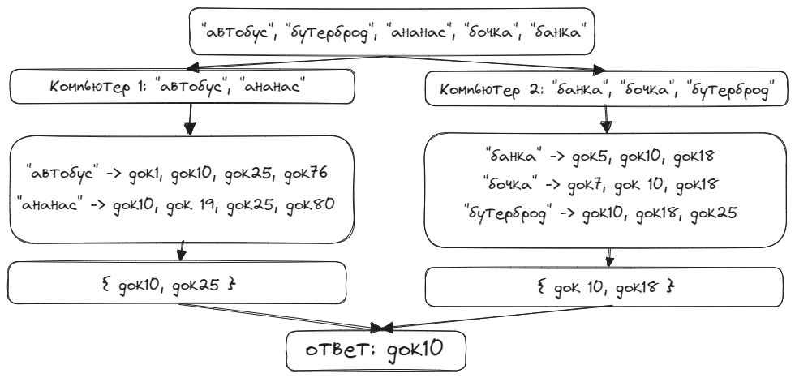
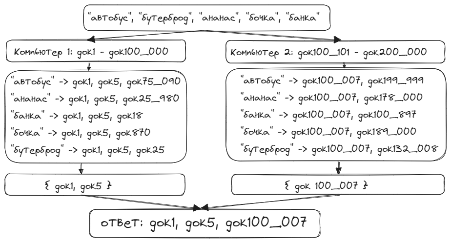

В этом посте рассмотрим поиск заданного списка слов в
миллионах документов, на основе примера задачи из книги "Cracking the coding interview".

У нас есть миллион документов, и список слов. Нужно найти все документы, которые содержат все заданные слова. Слова в
документе могут располагаться в произвольном порядке. Но слово не должно быть частью какого-то другого слова. 
Например, "кофе" не равно "кофемашина". 

Для начала надо выяснить, будет ли наша функция поиска вызвана единожды или много раз? Предположим, функция будет 
вызываться много раз, поэтому резонно с точки зрения производительности провести предварительные преобразования.  

#### Шаг 1.

Давайте предположим, как выглядела бы
наша функция поиска слов, если бы пришлось обрабатывать всего несколько десятков документов?

Можно предварительно проанализировать документы, и создать хэш-таблицу.
В хэш-таблице каждому слову сопоставим документы, в которых оно содержится.

```
"кофе" -> {"документ1", "документ3", "документ11"}
"горячий" -> {"документ1", "документ3", "документ5"}
```

Чтобы найти "горячий кофе", мы просто возьмем пересечение значений для "кофе" и "горячий". В результате получим `{"документ1", "документ3"}`.

#### Шаг 2.

Вернемся к ситуации, когда у нас миллионы документов. Скорее всего, памяти одного компьютера не хватит для обработки 
такого количества документов, поэтому нам понадобится разделить документы по нескольким компьютерам.
Также, в зависимости от количества искомых
слов и их повторений в документах, наша хэш-таблица тоже не обязательно уместится на одном компьютере. 


1. Возникает вопрос, как разделить хэш-таблицу. Несколько вариантов:
    + По ключевым словам. На одном компьютере, для конкретного слова будет список всех документов, в которых оно содержится.
    + По документам. На одном компьютере будет маппинг всех слов только для некого подмножества документов. 

2. Необходимо будет собрать результаты со всех компьютеров на один и проанализировать.

#### Шаг 3. 

На этом шаге найдем решения для задач, поставленных на шаге 2.

**Разделение по словам.**

Одно из решений - разделить таблицу по ключевым словам в алфавитном порядке.
Каждая машина будет хранить диапазон слов (например, на букву "а").
Мы можем реализовать простой алгоритм, который перебирает ключевые слова в алфавитном порядке и сохраняет на одном 
компьютере так много данных, как только возможно. А когда память заканчивается, переходит на другой компьютер.

+ **Плюсы подхода**: хэш-таблица получается маленькой и простой, поскольку содержит только диапазон искомых слов. 
+ **Недостаток подхода**: если добавляются новые слова, необходимо делать перенос ключевых слов и соответствующих 
  значений на другие машины, что может быть очень затратно.

Чтобы найти документы, в которых встречаются все заданные слова, мы сначала отсортируем список ключевых слов. Затем 
выполним на каждом компьютере поиск тех слов, которые входят в диапазон, присвоенный данному компьютеру. Например, 
мы ищем слова `{"автобус", "бутерброд", "ананас", "бочка", "банка"}`. Компьютер 1 находит все документы, содержащие 
слова "автобус" и все документы, содержащие "ананас". Затем он находит пересечение найденных множеств документов для 
этих слов. Компьютер 2 делает то же самое для слов "банка", "бочка", "бутерброд". 
Затем, другой компьютер находит пересечение результатов для компьютеров 1 и 2.




**Разделение по документам.**

Если же мы организовали разделение по документам, все проще. 
Например, компьютер 1 делает маппинг слов для документов 1-100000. Компьютер 2 - для документов 100001-200001. И т.д.
+ **Плюсы подхода**: если мы добавляем новые документы, они просто будут обрабатываться на новой машине. Никаких 
  переносов делать не нужно. 
+ **Недостаток подхода**: хэш-таблица может становиться очень большой для одного компьютера, если количество искомых 
  слов слишком велико.

Итак, на компьютере 1 мы создаем хэш-таблицу, которая содержит все искомые слова, и их наличие в документах 1-100000. 
Затем мы просто возьмем пересечение значений для всех слов. 
То же самое делаем для компьютера 2 и получаем искомые документы из диапазона 100001-200000.
Затем полученные результаты от всех компьютеров просто объединяем в список.




