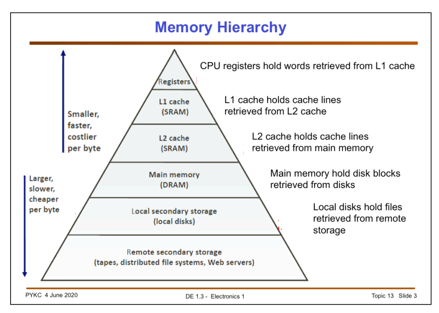

В этом посте я бы хотела рассказать об устройстве компьютера и затронуть тему реализации многопоточности.

### Из чего состоит компьютер

Компьютер имеет 3 главных компонента:
 - память
 - процессор (CPU - central processing unit)
 - устройства ввода-вывода (IO).

Все они соединены системной шиной, которая состоит из 3х шин:
 - шина адреса
 - шина данных
 - шина контроля

В этом посте рассмотрим подробнее память и процессор.

### Память

В любой компьютерной системе память всегда организована в виде иерархии.

_Источник - Imperial College London [1]._

В самом низу иерархии - **память в удаленных хранилищах**, например в облаке (Dropbox или Google Cloud). Эта память
самая медленная и дешевая, может быть очень больших размеров).

Далее идет локальная память компьютера.
**Постоянная** память - дешевая и медленная. Это например HHD или SSD диски.

Выше по иерархии **оперативная** память.
Она находится намного ближе к процессору и передает данные намного быстрее чем любой накопитель. Почти всегда имеет
тип DRAM (dynamic random access memory). DRAM использует микроскопические конденсаторы для хранения данных в виде
электрического заряда.

Еще выше по иерархии - кэши процессора.
Кэши имеют тип памяти SRAM (static random access).
Используют для хранения данных транзисторы, которые работают с той же скоростью, что логические блоки процессора
(примерно в 10 р быстрее DRAM).

Однако такой тип памяти менее компактный. В одном и том же объеме количество памяти в виде SRAM будет в десятки раз
меньше, чем в виде DRAM.
Но зато память SRAM будет быстрее, т.к. ее можно встроить прямо внутрь процессора.

Кэш имеет 3 линии.

_Источник - [6] https://habr.com/ru/companies/vdsina/articles/515660/_

Кэш L1 расположен ближе всего к логическим блокам процессора. Есть разные типы L1 кэша (кэш данных, кэш инструкций)
Этот кэш имеет размер порядка нескольких десятков КБ.

L2 кэш больше чем L1 кэш, порядка нескольких сотен КБ.
Это обобщенный блок хранения, содержит и инструкции и данные.

L3 кэш намного больше (от 2х до 32х МБ), но и намного меденнее.

Самые высокие в иерархии - регистры.
Они расположены ближе всего к логическим блокам процесора (ALU). Они тоже имеют тип SRAM. Их размер порядка
нескольких КБ.

Когда процессор выполняет операцию, в ходе которой нужно считать\записать данные в память, он начинает с проверки L1
кэша. Если данные обнаружены - произошло кэш-попадание (cache hit).
Если не обнаружены (промах кэша (cache miss)). Поиск будет продолжаться далее, вплоть до основного накопителя.

### Процессор

Процессор - что это ядро вычислительной системы компьютера.

Каждый процессор имеет свои собственные регистры, исполняющие устройства, кэши. При этом для прикладных программ все
должно работать так, как будто есть однородная общая память.

Внутри простого процессора есть:

- Счетчик команд (регистр) - хранит адрес инструкции, которую надо выполнять следующей

- Регистр команд - хранит инструкцию, которая выполняется в данный момент

- Арифметико-логическое устройство (ALU, Arithmetic/Logic Unit) - блок процессора, который выполняет
  арифметические/логические операции

- Аккумулятор (регистр) - сохраняется результат выполнения арифметических и логичеких команд

В большинстве повседневных систем (телефоны, ноутбуки, планшеты) находится один процессор. Два и более может быть в
серверах в каком-нибудь дата-центре. Делать компьютер с несколькими процессорами гораздо сложнее, т.к. надо
согласовать их работу, организовать между ними шину и т.д.
Накладные расходы взаимодействия могут убить весь выигрыш
параллельного выполнения.
Но чтобы снизить расходы, можно не дублировать процессоры, а продублировать схемы (ядра), исполняющие параллельные
команды, внутри процессора. Расположить их как можно ближе друг другу, на одном кристалле внутри процессора.

Обычно у ядер одного процессора L1 кэш у каждого свой, а L2 и L3 кэши могут быть как общими, так и приватными.

_Источник - [5] https://habr.com/ru/companies/intel/articles/243385/_

Чтобы еще больше увеличить количество потоков, можно не дублировать ядра, а для отдельного ядра продублировать лишь
регистры. Эта технология называется гиперпоточность (hyper-threading), и она была разработана в Intel.

Гиперпотоки полезны, когда есть приложения, у которых узкое место не в вычислениях, а в доступе к памяти.
Когда много промахов кэша, поток вынужден обращаться к ram, и простаивать (DRAM требуется примерно 100 наносекунд для
нахождения данных).

Получается, что можно иметь несколько процессоров k, в процессоре - несколько ядер m, и в одном ядре - несколько
гиперпотоков n.
Но для прикладных приложений операционная система скрывает реализацию, и для приложения будут видеть суммарно k * n * m
логических
потоков.

На обычном процессоре за управление потоками отвечает операционная система. Поток исполняется, пока не произойдет
аппаратное прерывание, системный вызов, либо не истечет время, отведенное потоку.

Источники:

1) [Memory and Computer Architecture](http://www.ee.ic.ac.uk/pcheung/teaching/DE1_EE/Lectures/Topic%2013%20-%20Memory%20and%20Computer%20Architecture%20(notes).pdf)

2) [How CPU works](http://www.ee.ic.ac.uk/pcheung/teaching/DE1_EE/Lectures/Topic%2014%20-%20How%20CPU%20works%20(notes).pdf)

3) [How Computers Work: The CPU and Memory](https://homepage.cs.uri.edu/faculty/wolfe/book/Readings/Reading04.htm)

4) [How Computers Work: Disks And Secondary Storage](https://homepage.cs.uri.edu/faculty/wolfe/book/Readings/Reading05.htm)

5) [Процессоры, ядра и потоки. Топология систем](https://habr.com/ru/companies/intel/articles/243385/)

6) [Зачем процессорам нужен кэш и чем отличаются уровни L1, L2, L3](https://habr.com/ru/companies/vdsina/articles/515660/)

7) [Multithreading (computer architecture)](https://en.wikipedia.org/wiki/Multithreading_(computer_architecture))

