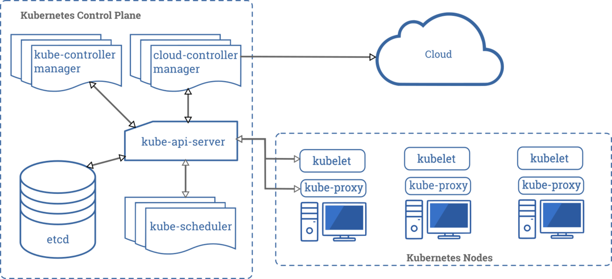

Kubernetes(k8s) - это opensource платформа для управления контейнеризованными сервисами. 

Для чего использовать k8s?
- упрощение декларативной настройки контейнерных приложений
- автоматическое масштабирование, управление и развертывание контейнеров
- балансировка нагрузки и распределение ресурсов для стабильного развертывания
- автоматизированный процесс обновлений
- управление конфиденциальной информацией и конфигурацией
- непрерывная разработка, интеграция и развертывание, разделение задач между Dev и Ops

Компоненты Kubernetes:

_Источник - kubernetes.io_

1. **Мастер-узел (Master Node)** содержит следующие компоненты:
  - **kube-api-server**: предоставляет API Kubernetes.
  - **etcd**: распределенное хранилище ключ-значение для хранения конфигураций кластера.
  - **kube-scheduler**: отвечает за планирование запуска подов на узлах кластера.
  - **kube-controller-manager**: запускает контроллеры (напр. Node controller, Endpoints controller), 
    управляющие состоянием кластера. Отслеживает состояние кластера и переводит его в желаемое состояние.
  - **cloud-controller-manager**: отвечает за взаимодействие с API облачного провайдера и управление циклами 
    контроллеров, специфичных для облачной инфраструктуры.

2. **Рабочий узел (Worker Node)** содержит следующие компоненты:
  - **kubelet**: агент, запущенный на каждом узле для управления контейнерами в подах, проверяет что поды в рабочем 
    состоянии.
  - **kube-proxy**: сетевой прокси для управления сетевым трафиком.

3. **Дополнительные компоненты**:
  - **DNS**: распределенная система имён для служб Kubernetes.
  - **Dashboard**: веб-интерфейс для управления кластером.
  - **Ingress Controller**: управляет внешним доступом к службам в кластере.

В Kubernetes существуют два способа управления: декларативный и императивный.

**Императивный** способ управления подразумевает прямое указание системе, что нужно сделать, например, создать под или сервис.

`$ kubectl {operation} {type} {name} [flags and options]`

Этот способ управления подходит для быстрого решения проблем и отладки, но не оптимален для управления крупными 
кластерами.

**Декларативный** способ управления заключается в описании желаемого состояния системы в YAML-файлах и передаче их в Kubernetes.
Kubernetes затем сравнивает текущее состояние системы с желаемым и принимает меры для достижения желаемого состояния.

`$ kubectl apply f {filename}`

Этот способ управления более предпочтителен для управления крупными кластерами.

Рассмотрим иерархию объектов в k8s:

**Pod:** минимальная развертываемая и управляемая единица в Kubernetes. Может содержать один или несколько 
контейнеров, которые работают вместе, имеют общие ресурсы и сетевое пространство. Под обычно используется для 
развертывания экземпляров приложений или микросервисов. Контейнеры внутри одного пода всегда запускаются на одном и том же узле.

**Deployment:** объект, который управляет развертыванием подов и их масштабированием. Обеспечивает декларативное 
обновление подов и управление версиями приложений. Позволяет легко масштабировать количество экземпляров приложения и управлять обновлениями без простоев.

**ReplicaSet:** гарантирует, что заданное количество реплик подов всегда запущено и работает. Используется для 
обеспечения высокой доступности приложений. Если какие-либо поды выходят из строя, ReplicaSet автоматически заменяет 
их новыми. ReplicaSet часто управляются через объекты более высокого уровня, такие как Deployment.

**Сервис (Service):** абстракция, которая определяет набор подов и политику доступа к ним. Обеспечивает постоянный 
IP-адрес и DNS-имя для взаимодействия с набором подов. Сервисы позволяют другим ресурсам в кластере общаться с подами, не зная их конкретные IP-адреса, и обеспечивают балансировку нагрузки между подами.

В Kubernetes существует несколько типов сервисов:

1. **ClusterIP**: назначает внутренний IP-адрес сервису, который доступен только внутри кластера. Он позволяет обращаться к сервису по его IP-адресу внутри кластера.

2. **NodePort**: открывает указанный порт на всех узлах кластера и перенаправляет трафик на указанный порт сервиса. Это позволяет обращаться к сервису по IP-адресу любого узла и порту, указанному в настройках сервиса.

3. **LoadBalancer**: автоматически создает балансировщик нагрузки в облачной среде (например, AWS, GCP, Azure) и 
   настраивает его для перенаправления трафика на сервис. Используется для обеспечения балансировки нагрузки и 
   доступности приложений.

4. **ExternalName**: позволяет проксировать запросы к сервису через внешний DNS-имя. Это удобно, когда необходимо 
   обращаться к внешнему ресурсу, например, базе данных, используя внутреннее DNS-имя.